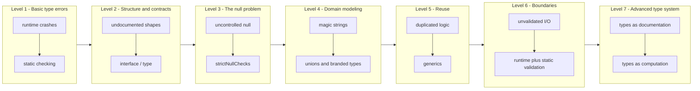

# typescriptes

**Every defect JavaScript lets you ship, and the TypeScript mechanism that stops it.**

A 29-point series, one problem at a time, each shipped as its own
self-contained, executable dissection — not a blog post, not a slide deck.
Every point lives in its own folder **and** its own branch, so the history of
the repo *is* the syllabus.

Every point is built to the same standard:

- **Scientist** — no claim about compiler behaviour without the real `tsc`
  output or the mechanism that produces it.
- **Expert** — correct terminology (soundness, narrowing, erasure, variance,
  discriminated union), defined the first time it appears.
- **Artist** — the invisible made visible: console traces of what the
  compiler believes at each line, before/after tables, and a concept map per
  point.

---

## Status

| | |
|---|---|
| **Points** | 29 |
| **Levels** | 7 |
| **Format** | one npm project per point, one branch per point |
| **Progress** | 2 / 29 complete |

```bash
cd point-01-type-errors
npm install
npm run demo:all      # 15 demos + the final report
npm run evidence      # real tsc diagnostics, unsuppressed
```

---

## The idea in one sentence

> Every entry below is a **JavaScript failure mode** on the left and the
> **TypeScript feature that closes it** on the right. Nothing is abstract —
> each row becomes a folder (`point-NN-slug/`) and a branch
> (`feature/point-NN-slug`) with runnable, broken-vs-fixed code.



Each level assumes only the levels before it — this is a ladder, not a menu.

---

## Table of contents — 7 levels, 29 points

Columns: the **JavaScript problem**, the **TypeScript answer**, the **folder /
branch** where the example lives, and its **status**.

### Level 1 — Basic type errors

| # | JavaScript problem | TypeScript answer | Folder / branch | Status |
|---|---|---|---|---|
| 01 | Type errors discovered at runtime | Static typing that catches them as you write | [`point-01-type-errors`](./point-01-type-errors/) · `feature/point-01-type-errors` | **complete** — 15 demos, 4 levels, evidence lab |
| 02 | Implicit coercion (`"5" + 3 === "53"`) | TS blocks the invalid operation before it runs | [`point-02-implicit-coercion`](./point-02-implicit-coercion/) · `feature/point-02-implicit-coercion` | **complete** — 14 demos, 4 levels, evidence lab |
| 03 | Typos in property names | Autocomplete and verification of the object's shape | `point-03-property-typos` · `feature/point-03-property-typos` | planned |
| 04 | `undefined is not a function` | Verification that the method exists before it is called | `point-04-undefined-not-a-function` · `feature/point-04-undefined-not-a-function` | planned |
| 05 | Too many or too few function parameters | Mandatory function signatures | `point-05-function-arity` · `feature/point-05-function-arity` | planned |
| 06 | Arguments passed in the wrong order | Distinct types per position | `point-06-argument-order` · `feature/point-06-argument-order` | planned |

### Level 2 — Structure and contracts

| # | JavaScript problem | TypeScript answer | Folder / branch | Status |
|---|---|---|---|---|
| 07 | Not knowing the shape of an object | `interface` and `type` | `point-07-object-shape` · `feature/point-07-object-shape` | planned |
| 08 | Unpredictable return values | Explicit return types | `point-08-return-types` · `feature/point-08-return-types` | planned |
| 09 | Undocumented APIs | Types are the documentation | `point-09-types-as-docs` · `feature/point-09-types-as-docs` | planned |
| 10 | Refactoring without knowing what breaks | The compiler lists everything affected | `point-10-safe-refactor` · `feature/point-10-safe-refactor` | planned |
| 11 | Renaming properties by hand | Safe rename across the whole project | `point-11-safe-rename` · `feature/point-11-safe-rename` | planned |
| 12 | Mutable objects with no control | `readonly`, `as const` | `point-12-immutability` · `feature/point-12-immutability` | planned |

### Level 3 — The null problem

| # | JavaScript problem | TypeScript answer | Folder / branch | Status |
|---|---|---|---|---|
| 13 | Uncontrolled `null` / `undefined` | `strictNullChecks` | `point-13-strict-null-checks` · `feature/point-13-strict-null-checks` | planned |
| 14 | Optional chaining used without a safety net | TS knows when `?.` is needed and when it is redundant | `point-14-optional-chaining` · `feature/point-14-optional-chaining` | planned |
| 15 | Cases left unhandled in conditionals | Narrowing and exhaustiveness checking | `point-15-exhaustiveness` · `feature/point-15-exhaustiveness` | planned |

### Level 4 — Domain modeling

| # | JavaScript problem | TypeScript answer | Folder / branch | Status |
|---|---|---|---|---|
| 16 | Magic strings (`status: "active"`) | Union types and enums | `point-16-magic-strings` · `feature/point-16-magic-strings` | planned |
| 17 | Impossible states are representable | Discriminated unions | `point-17-discriminated-unions` · `feature/point-17-discriminated-unions` | planned |
| 18 | Indistinguishable primitives (a `userId` and an `orderId` are both `string`) | Branded types | `point-18-branded-types` · `feature/point-18-branded-types` | planned |
| 19 | Duplicating similar types | Utility types (`Partial`, `Pick`, `Omit`) | `point-19-utility-types` · `feature/point-19-utility-types` | planned |

### Level 5 — Reuse

| # | JavaScript problem | TypeScript answer | Folder / branch | Status |
|---|---|---|---|---|
| 20 | Duplicated code per type | Generics | `point-20-generics` · `feature/point-20-generics` | planned |
| 21 | Functions that lose type information as data flows through | Generic inference | `point-21-generic-inference` · `feature/point-21-generic-inference` | planned |
| 22 | Constraining generics | `extends` | `point-22-generic-constraints` · `feature/point-22-generic-constraints` | planned |

### Level 6 — Boundaries and ecosystem

| # | JavaScript problem | TypeScript answer | Folder / branch | Status |
|---|---|---|---|---|
| 23 | Unvalidated data from external APIs | Types plus runtime validation (Zod) | `point-23-runtime-validation` · `feature/point-23-runtime-validation` | planned |
| 24 | Untyped JavaScript libraries | Declaration files (`.d.ts`), DefinitelyTyped | `point-24-declaration-files` · `feature/point-24-declaration-files` | planned |
| 25 | Modules and imports that go unverified | Typed module resolution | `point-25-module-resolution` · `feature/point-25-module-resolution` | planned |

### Level 7 — Advanced type system

| # | JavaScript problem | TypeScript answer | Folder / branch | Status |
|---|---|---|---|---|
| 26 | Conditional type logic | Conditional types | `point-26-conditional-types` · `feature/point-26-conditional-types` | planned |
| 27 | Transforming types programmatically | Mapped types | `point-27-mapped-types` · `feature/point-27-mapped-types` | planned |
| 28 | Manipulating strings at the type level | Template literal types | `point-28-template-literal-types` · `feature/point-28-template-literal-types` | planned |
| 29 | Compiler configuration that varies per project | `tsconfig.json` and its strict modes | `point-29-tsconfig-strict-modes` · `feature/point-29-tsconfig-strict-modes` | planned |

---

## Branch and folder strategy

Each point is developed in isolation, then merged back:

```
main
 - feature/point-01-type-errors        -> point-01-type-errors/          merged
 - feature/point-02-implicit-coercion  -> point-02-implicit-coercion/
 - feature/point-03-property-typos     -> point-03-property-typos/
 - ...                                 -> ... (one branch per row above)
```

Rules that keep the series honest:

1. **One branch, one point.** A branch never mixes two rows of the table.
2. **The folder name is the branch name minus `feature/`.** No renaming games.
3. **A point is only "complete" once it has demos, an evidence lab, and a
   concept map** — the same anatomy as point 01 (see below).
4. **The table above is the single source of truth for scope.** If a point
   needs to change, the table changes first, in its own commit.

---

## The shape of every point

Each point is a standalone npm project with the same anatomy, so the series is
navigable in any order once point 01 is understood:

```
point-NN-<slug>/
├── README.md                 how to run every demo
├── package.json              one npm script per demo
├── tsconfig.json             strict: true, every flag annotated
├── tsconfig.evidence.json    the evidence lab
├── docs/concept-map.md       hierarchical decomposition (lists + Mermaid)
└── src/
    ├── 00-foundations/       manifesto.md — the theory, precisely
    ├── 01-basic/             the mechanism at its simplest
    ├── 02-intermediate/      realistic domain code
    ├── 03-advanced/          the machinery: narrowing, guards, exhaustiveness
    ├── 04-expert/            the compiler's model, and where it stops
    └── 99-runner/            traces, proofs, CLI, final report
```

And the same file pattern per demo:

| file | role |
|---|---|
| `*.js-broken.ts` | the JavaScript version (`// @ts-nocheck`) — it runs, and misbehaves |
| `*.ts-safe.ts` | the TypeScript version — the same defects, each `// @ts-expect-error`ed |
| `*.explanation.md` | the dissection: mechanism, set-theoretic reasoning, tables, limits |
| `_level-NN.tsc-error.ts` | the evidence fixture — real, unsuppressed diagnostics |

### Three non-negotiable rules

1. **`@ts-expect-error`, never `@ts-ignore`.** The former asserts that an error
   *exists* (TS2578 if it stops existing), so every demo doubles as a regression
   test of compiler behaviour.
2. **Compile-time claims must be machine-verified.** `proveType<T>()(value, …)`
   fails to compile unless the compiler's belief matches the printed string, so
   the traces are renderings of proved facts rather than promises.
3. **Every quoted diagnostic comes from the evidence lab.** `npm run evidence`
   compiles the broken fixtures and prints the compiler's own words, elaboration
   chains included.

---

## License

See [LICENSE](./LICENSE).
