# Concept map — Point 01: compile-time detection of type errors

A navigable decomposition of Concept #1, from the root claim down to each
concrete mechanism. Every leaf names the demo that demonstrates it.

> **Concept #1.** Type errors that in JavaScript surface only at runtime are
> caught by TypeScript at compile time, as you write.

---

## The tree, in one picture

```mermaid
graph TD
    R["<b>Compile-time detection of type errors</b><br/>errors found before execution, for all inputs"]

    R --> F["<b>1. Foundations</b><br/>what makes it possible"]
    R --> M["<b>2. Checking mechanisms</b><br/>how the compiler decides"]
    R --> D["<b>3. Design mechanisms</b><br/>how you make errors unwriteable"]
    R --> L["<b>4. Limits</b><br/>where the guarantee stops"]

    F --> F1["compile time vs runtime<br/><i>two disjoint phases</i>"]
    F --> F2["type erasure<br/><i>types vanish at emit; zero runtime cost</i>"]
    F --> F3["a type is a set of values<br/><i>assignability = subset inclusion</i>"]
    F --> F4["universal quantification<br/><i>a proof over all executions, not one</i>"]

    M --> M1["assignability<br/><i>may this value inhabit this binding?</i>"]
    M --> M2["operator rules<br/><i>which operand types each operator admits</i>"]
    M --> M3["member resolution<br/><i>static lookup instead of prototype walk</i>"]
    M --> M4["signature checking<br/><i>arity, position, return, completeness</i>"]
    M --> M5["control flow analysis<br/><i>flow-sensitive types along the CFG</i>"]
    M --> M6["inference<br/><i>widening, freshness, contextual typing</i>"]

    M5 --> N1["typeof / in / instanceof guards"]
    M5 --> N2["discriminant narrowing"]
    M5 --> N3["user-defined guards <code>v is T</code>"]
    M5 --> N4["assertion signatures <code>asserts v is T</code>"]
    M5 --> N5["narrowing to <code>never</code><br/><i>a proof of unreachability</i>"]

    D --> D1["union types<br/><i>write the possibilities down</i>"]
    D --> D2["literal types<br/><i>the value itself becomes a type</i>"]
    D --> D3["discriminated unions<br/><i>illegal states unrepresentable</i>"]
    D --> D4["exhaustiveness<br/><i>assertNever, Record, satisfies, match</i>"]
    D --> D5["branded types<br/><i>nominal typing where shape is not enough</i>"]
    D --> D6["readonly / tuples<br/><i>mutability and arity as types</i>"]

    L --> L1["<code>as</code> and <code>!</code><br/><i>unchecked assertions</i>"]
    L --> L2["<code>any</code> and the I/O boundary<br/><i>JSON.parse, fetch, env, drivers</i>"]
    L --> L3["deliberate unsoundness<br/><i>bivariance, readonly aliasing, indexing</i>"]
    L --> L4["undecidability<br/><i>Rice's theorem; recursion budgets</i>"]
    L --> L5["logic errors<br/><i>type-correct and still wrong</i>"]
```

---

## The tree, as a navigable index

### 0. Root

- **Compile-time detection of type errors** — the compiler derives, from the
  program text alone, that no expression is handed a value it cannot accept;
  the conclusion holds for every execution.
  → `src/00-foundations/manifesto.md`

### 1. Foundations — what makes it possible

- **Compile time vs runtime** — two disjoint phases; the checker reasons about
  all executions, the engine about one. → manifesto §1
- **Type erasure** — annotations, interfaces, generics and assertions are
  deleted at emit; safety costs zero nanoseconds and leaves no runtime residue.
  → manifesto §2, `npm run erasure`
  - **`erasableSyntaxOnly`** — rejects the constructs that are *not* pure
    erasure (`enum`, `namespace`, parameter properties), making "compilation is
    erasure" a machine-checked invariant. → demo 11 (TS1294)
- **A type is a set of values** — assignability is subset inclusion; `never` is
  ∅; `unknown` is the universal set; `any` is not a set but an instruction to
  stop checking. → manifesto §3
- **Universal quantification** — a passing test is existential ("there exists an
  input that worked"); a passing type check is universal ("for all inputs").
  → manifesto §4

### 2. Checking mechanisms — how the compiler decides

- **Assignability** — may a value of type S inhabit a location of type T?
  → demo 01 · TS2322
  - **Freshness / excess-property checking** — object literals carry an extra
    obligation so that typos are not hidden by structural subtyping.
    → demo 05 · TS2561
  - **`exactOptionalPropertyTypes`** — "absent" and "present but undefined" are
    different states. → demo 05 · TS2375
- **Operator rules** — which operand types each operator admits; the overloaded
  `+` versus every other arithmetic operator. → demo 02 · TS2362/TS2363/TS2365
- **Member resolution** — `x.foo` resolved against the declared members of the
  *type* rather than the prototype chain of the *value*; the READ is the error.
  → demo 03 · TS2339/TS2551
- **Signature checking** — arity, argument position, return type, completeness
  of returns; callbacks included. → demo 04 · TS2554/TS2345/TS2322/TS2366
- **Element and index rules** — homogeneity over time, mutation, tuple arity,
  and the honest treatment of bounds. → demo 06 · TS2322/TS2345/TS2532/TS2540
- **Control flow analysis** — a reference has different types at different
  program points; narrowing is set subtraction along CFG edges, merging is
  union, assignment resets. → demo 07
  - **`typeof` / `in` / `instanceof` / `Array.isArray` guards** → demo 07
  - **Discriminant narrowing** → demos 08, 13
  - **User-defined guards `value is T`** → demo 09 · TS2677
  - **Assertion signatures `asserts value is T`** → demo 09
  - **Narrowing to `never`** — the residual set is empty ⇒ unreachable.
    → demo 10 · TS2345
- **Inference** — widening of fresh literal types, `as const`, bidirectional
  (contextual) typing, and the four declaration spaces the checker maintains.
  → demo 11

### 3. Design mechanisms — how you make errors unwriteable

- **Union types** — write the set of possibilities down; an operation is valid
  only if valid for every member. → demo 08 · TS2339
- **Literal types** — the value itself becomes a type (`"draft"`, `200`), which
  is what makes discriminants possible. → demos 08, 10
- **Discriminated unions** — a literal-typed common member selects exactly one
  shape; impossible states have no type to inhabit. → demo 13 · TS2353/TS2739
- **Exhaustiveness** — `assertNever`, `Record<Union, T>`, `satisfies`, a typed
  `match`, `Expect<Equals<…>>`. → demos 10, 14 · TS2345/TS2741/TS2344
- **Branded (nominal) types** — two structurally identical strings made
  mutually unassignable, for the swapped-argument bug no signature can catch.
  → demo 04 · TS2345
- **`readonly` and tuples** — mutability and arity expressed as types.
  → demo 06 · TS2540/TS4104

### 4. Limits — where the guarantee stops

- **`as` and `!`** — assertions the compiler does not verify and does not emit
  a check for; `x as unknown as T` defeats even the overlap guard.
  → demo 12 · TS2352
- **`any` and the I/O boundary** — `JSON.parse`, `fetch`, `process.env`, DB
  drivers. Fix: parse to `unknown` and validate at the edge. → demos 09, 12
- **Deliberate unsoundness** — method-parameter bivariance, shallow and
  alias-blind `readonly`, unchecked array indexing, unverified guard bodies.
  → demo 12 · TS2322/TS4104
- **Undecidability** — Rice's theorem; a Turing-complete type system; the
  recursion budgets and TS2589. → demo 15
- **Logic errors** — `[10,9,100].sort()` and `retries ? retries : 3` are
  type-correct and wrong. A type checker catches type errors.
  → demos 06, 07, 15

---

## Reading order

| if you want… | read / run |
|---|---|
| the theory first | `src/00-foundations/manifesto.md`, then `npm run erasure` |
| the shortest convincing demo | `npm run demo:01-primitives` |
| the mechanism behind unions | demos 07 → 08 → 10 |
| the design lesson | demo 13, then demo 14 |
| the honest limits | demo 12, then demo 15 |
| proof rather than prose | `npm run evidence` |
| everything, in order | `npm run demo:all` |
