# Concept map — Point 02: prevention of unintended implicit coercion

A navigable decomposition of Concept #2, from the root claim down to each
concrete mechanism. Every leaf names the demo that demonstrates it.

> **Concept #2.** JavaScript silently coerces values between types
> (`"5" + 3 === "53"`, `0 == ""`, `null - 1 === -1`), producing results the
> programmer never intended. TypeScript blocks these invalid mixed-type
> operations at compile time and forces every conversion to be explicit.

---

## The tree, in one picture

```mermaid
graph TD
    R["<b>Prevention of unintended implicit coercion</b><br/>every conversion becomes a decision with a location"]

    R --> F["<b>1. Foundations</b><br/>the ECMAScript machinery being tamed"]
    R --> O["<b>2. Operator rules</b><br/>what tsc checks per operator family"]
    R --> D["<b>3. Design mechanisms</b><br/>how you make coercion bugs unwriteable"]
    R --> L["<b>4. Limits</b><br/>where the guarantee stops"]

    F --> F1["ToPrimitive<br/><i>object -> primitive, valueOf/toString/Symbol.toPrimitive</i>"]
    F --> F2["ToNumber<br/><i>null=0, undefined=NaN, '' =0, whitespace trimmed</i>"]
    F --> F3["ToString<br/><i>total: every value has a string form</i>"]
    F --> F4["ToBoolean<br/><i>a fixed, 8-value falsy list</i>"]
    F --> F5["Abstract Equality Comparison<br/><i>IsLooselyEqual: 11 branches, non-transitive</i>"]

    O --> O1["the + rule<br/><i>number+number, or at least one string</i>"]
    O --> O2["-, *, /, %, ** rule<br/><i>both operands must be numeric, unconditionally</i>"]
    O --> O3["== / === comparability<br/><i>TS2367: reject provably-disjoint types</i>"]
    O --> O4["null/undefined in arithmetic<br/><i>TS18047/TS18048/TS18050, distinct from TS2362/2363</i>"]
    O --> O5["union operands<br/><i>legal only if legal for every member</i>"]
    O --> O6["custom coercion hooks<br/><i>valueOf/Symbol.toPrimitive: a policy per operator</i>"]

    D --> D1["explicit conversion at the boundary<br/><i>Number()/String() named, once, auditable</i>"]
    D --> D2["?? over \|\|<br/><i>only null/undefined trigger the fallback</i>"]
    D --> D3["branded types<br/><i>structural typing's blind spot, closed with unique symbol</i>"]
    D --> D4["schema validation<br/><i>a Schema&lt;T&gt; that IS the type and the check</i>"]
    D --> D5["never-guarded generics<br/><i>a witness tuple makes a call unwritable</i>"]

    L --> L1["truthiness beyond null/undefined<br/><i>0, '', NaN, false — a logic error, not a type error</i>"]
    L --> L2["string + object, and every template hole<br/><i>+string and \${...} accept everything, always</i>"]
    L --> L3["as and any<br/><i>assert without checking; disable checking, contagiously</i>"]
    L --> L4["hooks the checker can't see into<br/><i>TS2367 is structural, blind to valueOf</i>"]
```

---

## The tree, as a navigable index

### 0. Root

- **Prevention of unintended implicit coercion** — every conversion between
  types becomes either a named, explicit function call or a compile error at
  the exact line an undeclared conversion would otherwise have run silently.
  → `src/00-foundations/manifesto.md`

### 1. Foundations — the ECMAScript machinery being tamed

- **`ToPrimitive`** — the algorithm every coercion of an object starts with;
  tries `valueOf` then `toString` (or the reverse for hint `"string"`),
  unless `Symbol.toPrimitive` overrides it entirely. → manifesto §2, demos 05, 10
- **`ToNumber`** — `null` → `0`, `undefined` → `NaN`, `""` → `0`,
  whitespace trimmed, partial parses rejected. → manifesto §2, demos 02, 06
- **`ToString`** — total: every type, including objects, has a string form.
  → manifesto §2, demo 09
- **`ToBoolean`** — a fixed, finite, eight-value falsy list; every object is
  truthy regardless of contents. → manifesto §2, demo 03
- **The Abstract Equality Comparison Algorithm** — `IsLooselyEqual`'s eleven
  ordered branches; famously non-transitive (`"" == 0`, `0 == "0"`,
  `"" == "0"` is `false`). → manifesto §3, demo 07

### 2. Operator rules — what `tsc` actually checks, per operator family

- **The `+` rule** — `number + number → number`; otherwise, at least one
  side `string → string`; everything else rejected. → demo 01 · TS2322/TS2365/TS18050
- **`-`, `*`, `/`, `%`, `**`** — both operands must be `any`/`number`/
  `bigint`/enum, unconditionally; no string branch to preserve.
  → demo 02 · TS2362/TS2363
- **`==`/`===` comparability** — rejected when the two types provably share
  no value, with a deliberate exemption for `null`/`undefined` comparisons.
  → demo 04 · TS2367
  - **Object-to-primitive edge cases** — array/array and object/object
    rejected the same way; string+object is NOT (a stated gap).
    → demo 05 · TS2365
- **`null`/`undefined` in arithmetic** — a distinct diagnostic family
  (TS18047/TS18048 for unions, TS18050 for bare literals) from the
  never-numeric TS2362/TS2363. → demo 06
- **Union operands** — an operation on `A | B` is legal only if legal for
  every member; narrowing (`typeof`) is the fix. → demo 08 · TS2365
- **Custom coercion hooks** — `valueOf`/`Symbol.toPrimitive` change the
  outcome per OPERATOR FAMILY: binary `+` still rejected, relational
  operators trust the hook, `==` still structural. → demo 10 · TS2365/TS2367
- **A hand-built comparability check** — `Overlaps<A,B>` reproduces TS2367's
  analysis explicitly, as a reusable generic guard. → demo 07 · TS2554

### 3. Design mechanisms — how you make coercion bugs unwriteable

- **Explicit conversion at the boundary** — `Number()`/`String()` called
  once, by name, in an auditable place, instead of implicitly inside an
  operator. → demos 01, 02, 06
- **`??` over `\|\|`** — a distinct operator scoped to `null`/`undefined`
  only, so `0` and `""` survive as real data. → demo 03
- **Branded (nominal-by-convention) types** — closes structural typing's
  blind spot for values that are the same primitive but different meanings.
  → demo 11 · TS2345
- **Schema-based boundary validation** — a `Schema<T>` function that IS both
  the type and the runtime check, so they cannot drift apart. → demo 13
- **`never`-guarded generics** — a witness parameter typed `never` makes an
  entire class of miscall structurally impossible to write. → demo 14 · TS2554

### 4. Limits — where the guarantee stops

- **Truthiness beyond `null`/`undefined`** — `strictNullChecks` only ever
  removes `null`/`undefined`; `0`, `""`, `NaN`, `false` remain exactly as
  ambiguous as in plain JavaScript. A logic error, not a type error.
  → demo 03
- **`string + object` and every template-literal hole** — the string branch
  of `+`, and `${...}` interpolation, accept every type unconditionally.
  → demos 05, 09
- **`as` and `any`** — an assertion the compiler does not verify; a type
  that disables checking and spreads through inference. → demo 12
- **Hooks the checker cannot see into** — TS2367's comparability analysis
  is purely structural and blind to `valueOf`/`Symbol.toPrimitive`.
  → demo 10

---

## Reading order

| if you want… | read / run |
|---|---|
| the theory first | `src/00-foundations/manifesto.md` |
| the shortest convincing demo | `npm run demo:01-plus-operator` |
| the equality algorithm, traced | demo 04, then demo 07 |
| the design lesson | demo 11, then demo 13, then demo 14 |
| the honest limits | demos 03, 05, 09, then demo 12 |
| proof rather than prose | `npm run evidence` |
| everything, in order | `npm run demo:all` |
