# Concept map — Point 03: typos in property names

A navigable decomposition of Concept #3, from the root claim down to each
concrete mechanism. Every leaf names the demo that demonstrates it.

> **Concept #3.** In JavaScript, misspelling a property name (`user.nam`
> instead of `user.name`) silently returns `undefined`, and the bug
> propagates until it detonates somewhere far away. TypeScript verifies,
> against the declared shape of every object, that each property you read or
> write actually exists — flagging the typo the instant you type it, and
> offering autocomplete so it never happens.

---

## The tree, in one picture

```mermaid
graph TD
    R["<b>Compile-time verification of property names</b><br/>every read/write checked against a declared shape"]

    R --> F["<b>1. Foundations</b><br/>what makes it possible"]
    R --> A["<b>2. Access mechanisms</b><br/>reading and writing a single property"]
    R --> C["<b>3. Construction mechanisms</b><br/>building a value from scratch"]
    R --> S["<b>4. Structural mechanisms</b><br/>comparing and computing shapes"]
    R --> K["<b>5. Keys as values</b><br/>property names that travel as data"]
    R --> L["<b>6. Limits</b><br/>where the guarantee stops"]

    F --> F1["shape / property map<br/><i>a finite function from key to type</i>"]
    F --> F2["structural (duck) typing<br/><i>assignability compares maps, not names</i>"]
    F --> F3["member resolution<br/><i>static lookup vs runtime prototype walk</i>"]

    A --> A1["read access<br/><i>TS2339 / TS2551 — demo 01</i>"]
    A --> A2["write access<br/><i>TS2339 / TS2551, then TS2322 — demo 02</i>"]
    A --> A3["nested / chained access<br/><i>each '.' resolved independently — demo 05</i>"]
    A --> A4["readonly<br/><i>existence checked before mutability — TS2540, demo 06</i>"]
    A --> A5["optional properties<br/><i>the key stays IN the map — TS18048, demo 04</i>"]
    A --> A6["index signatures<br/><i>[key: string]: T widens the map's domain — demo 07</i>"]

    C --> C1["required-member checking<br/><i>TS2741 / TS2739 — demo 03</i>"]
    C --> C2["excess-property checking (freshness)<br/><i>TS2561 / TS2353 — demo 03</i>"]
    C --> C3["freshness is scoped to the literal<br/><i>lost through any intermediate binding — demo 09</i>"]

    S --> S1["structural typing, restated<br/><i>independent interfaces, same map, compatible — demo 08</i>"]
    S --> S2["keyof T<br/><i>the property map, reified as a literal-string union — demo 10</i>"]
    S --> S3["mapped + template-literal keys<br/><i>GENERATED property maps, equally checkable — demo 11</i>"]
    S --> S4["resolution order<br/><i>own -> inherited -> index signature -> error — demo 12</i>"]

    K --> K1["keyof-constrained generics<br/><i>a property name passed as an argument, still checked — demo 10</i>"]
    K --> K2["exhaustiveness over keyof T<br/><i>{ [K in keyof T]: X } — one entry per key, no more, no fewer — demo 15</i>"]
    K --> K3["rename / refactor safety<br/><i>a rename invalidates every reference at once — demo 14</i>"]
    K --> K4["satisfies<br/><i>shape-checked without widening the literal — demo 14</i>"]
    K --> K5["symbol keys / unique symbol<br/><i>identity by reference, not spelling — demo 16</i>"]

    L --> L1["any<br/><i>no property map exists — demo 13</i>"]
    L --> L2["as T<br/><i>the assertion itself is unchecked — demo 13</i>"]
    L --> L3["as unknown as T<br/><i>defeats even the overlap guard — demo 13</i>"]
    L --> L4["the I/O boundary<br/><i>JSON.parse, fetch — declared shape vs actual data — demo 13</i>"]
```

---

## The tree, as a navigable index

### 0. Root

- **Compile-time verification of property names** — every `.key` read or
  write is checked against the declared property map of its type, before
  the program runs. → `src/00-foundations/manifesto.md`

### 1. Foundations — what makes it possible

- **Shape / property map** — a type is, among other things, a finite
  function from property names to value types; this is the artefact every
  other mechanism in this project checks against. → manifesto §1
- **Structural (duck) typing** — assignability compares property maps, not
  declared names; chosen because it lets TypeScript layer onto an ecosystem
  of already-untyped JavaScript. → manifesto §2, demo 08
- **Member resolution** — `expr.key` is resolved statically, once, against
  a precomputed map — not by simulating a runtime search. → demo 12

### 2. Access mechanisms — reading and writing a single property

- **Read access** — `user.nam` → TS2339, or TS2551 with a spelling
  suggestion when a close match exists. → demo 01
- **Write access** — key-existence checked first (TS2339/TS2551), value
  type checked second (TS2322) — two independent rules. → demo 02
- **Nested / chained access** — `a.b.c` is three independent lookups; a typo
  is caught at the exact link that broke, regardless of depth. → demo 05
- **`readonly`** — existence is checked before mutability; a misspelled
  readonly member is never reported as TS2540. → demo 06
- **Optional properties (`?`)** — the key stays IN the property map with
  value type `T | undefined` (TS18048 when unguarded); categorically
  different from a typo, which is never in the map at all (TS2339).
  → demo 04
- **Index signatures** — `[key: string]: T` widens the map's domain to
  every string, the one place typo protection is deliberately traded away.
  → demo 07 · TS4111

### 3. Construction mechanisms — building a value from scratch

- **Required-member checking** — every non-optional key must be present.
  → demo 03 · TS2741 / TS2739
- **Excess-property checking (freshness)** — a fresh object literal may
  declare no member the target doesn't recognize. → demo 03 · TS2561/TS2353
- **Freshness is scoped to the literal** — lost the instant the same shape
  passes through any intermediate binding; ordinary structural subtyping
  takes over from there. → demo 09

### 4. Structural mechanisms — comparing and computing shapes

- **Structural typing, restated** — two independently-declared interfaces
  with the same property map are mutually assignable, with zero
  coordination. → demo 08
- **`keyof T`** — the property map reified as a checkable union of
  string-literal types; indexed access `T[K]` tracks the exact value type.
  → demo 10 · TS2345
- **Mapped + template-literal keys** — `{ [K in keyof T as \`get${...}\`]: X }`
  generates a brand-new, equally checkable property map. → demo 11 · TS2561
- **Resolution order** — own declared members, then inherited (flattened
  into the same map), then an index signature, then rejection. → demo 12

### 5. Keys as values — property names that travel as data

- **`keyof`-constrained generics** — a property name passed as a function
  argument stays checked against the source type's map. → demo 10 · TS2345
- **Exhaustiveness over `keyof T`** — `{ [K in keyof T]: X }` requires
  exactly one entry per key; the `keyof`-analogue of `never`-exhaustiveness
  over union members. → demo 15 · TS2741/TS2561
- **Rename / refactor safety** — a rename is an edit to one declaration;
  every reference is re-checked against the new map simultaneously, not a
  separate compiler feature. → demo 14 · TS2339
- **`satisfies`** — validates a literal's shape identically to `: T`,
  without widening the literal's own inferred type away. → demo 14 · TS2561
- **Symbol keys / `unique symbol`** — identity by reference, not spelling;
  the same property-map check, parameterised over what "the same key"
  means. → demo 16 · TS7053

### 6. Limits — where the guarantee stops

- **`any`** — `JSON.parse` and friends return a type with no property map
  to check a name against. → demo 13
- **`as T`** — the assertion itself is unchecked; it can succeed via
  reverse assignability without even needing a double cast. → demo 13
- **`as unknown as T`** — defeats even the "sufficient overlap" guard
  (TS2352) that single assertions are held to. → demo 13
- **The I/O boundary** — TypeScript verifies the DECLARED shape, never the
  ACTUAL data arriving from outside the program. → demo 13, manifesto §2

---

## Reading order

| if you want… | read / run |
|---|---|
| the theory first | `src/00-foundations/manifesto.md` |
| the shortest convincing demo | `npm run demo:01-read-typo` |
| the freshness subtlety, in full | demo 03, then demo 09 |
| why generic/dynamic keys stay protected | demos 10 → 15 |
| the honest limits | demo 13 |
| proof rather than prose | `npm run evidence` |
| everything, in order | `npm run demo:all` |
