# Concept map — Concept #5: compile-time enforcement of parameter arity and types

> **Root claim.** A parameter list is a typed, arity-bounded contract: a
> minimum required count, a maximum allowed count (possibly unbounded), and
> a declared type at every position. `f(...)` type-checks iff the supplied
> argument count falls within that interval AND every supplied argument is
> assignable to its position's type — checked entirely from declared types,
> before any code runs.
>
> Read `src/00-foundations/manifesto.md` first — it derives the root claim.
> This document indexes what follows from it.

---

## Mermaid overview

```mermaid
flowchart TD
    ROOT["Compile-time enforcement of parameter arity and types<br/>(a parameter list is an arity-bounded, per-position typed contract)"]

    ROOT --> ARITY["Arity bounds<br/>minimum required count, maximum allowed count"]
    ROOT --> POSITION["Per-position type checking<br/>independent of the count check"]
    ROOT --> IDENTITY["Omitted vs. explicit undefined<br/>arity counts SLOTS, not non-undefined values"]
    ROOT --> RELAX["Arity-relaxing parameter kinds<br/>optional, default, rest — each changes the bounds differently"]
    ROOT --> ORDER["Declaration-order rules<br/>keep positional resolution unambiguous"]
    ROOT --> SHAPE["Fixed-shape argument lists<br/>tuples, labeled tuples, destructuring"]
    ROOT --> SPREAD["Spread arguments<br/>a spread's contribution to arity must be statically knowable"]
    ROOT --> OVERLOAD["Overload resolution by arity<br/>multiple signatures distinguished by parameter count"]
    ROOT --> GENERIC["Generic / variadic arity<br/>a parameter list computed from a type parameter"]
    ROOT --> VARIANCE["Function-type arity assignability<br/>fewer declared parameters always substitutes; more never does"]
    ROOT --> LIMITS["Soundness limits<br/>where the guarantee stops applying"]

    ARITY --> A1["demo 01 — too few arguments (TS2554)"]
    ARITY --> A2["demo 02 — too many arguments (TS2554)"]

    POSITION --> P1["demo 03 — right count, wrong type at a position (TS2345)"]

    IDENTITY --> I1["demo 04 — explicit undefined vs. omitted argument (TS2345 / TS2554)"]

    RELAX --> R1["demo 05 — optional parameters, T | undefined (TS18048)"]
    RELAX --> R2["demo 06 — default parameters, omission vs. null vs. undefined (TS2345)"]
    RELAX --> R3["demo 07 — rest parameters, unbounded arity, uniform typing (TS2345)"]

    ORDER --> O1["demo 08 — required after optional/defaulted (TS1016 / TS2554)"]

    SHAPE --> S1["demo 09 — tuple parameters and labeled tuples (TS2322 / TS2554)"]
    SHAPE --> S2["demo 12 — destructured parameters, checked field by field (TS2561 / TS2345)"]

    SPREAD --> SP1["demo 10 — spread arguments, tuple vs. plain array (TS2556)"]

    OVERLOAD --> OV1["demo 11 — overload resolution driven by arity (TS2575)"]

    GENERIC --> G1["demo 13 — the five-step resolution algorithm, narrated (TS2345)"]
    GENERIC --> G2["demo 14 — variadic tuple types, a typed partial application (TS2554 / TS2345)"]

    VARIANCE --> V1["demo 16 — arity substitution rules + strictFunctionTypes bivariance (TS2345 / TS2322)"]

    LIMITS --> L1["demo 15 — any, Function, as, .apply reopening the arity hole"]
    LIMITS --> L2["demo 17 — a never-based compile-time-only arity guard (TS2345)"]

    style ROOT fill:#4c1d95,color:#fff
    style LIMITS fill:#7c2d12,color:#fff
```

---

## Navigable index

- **Compile-time enforcement of parameter arity and types** — the root mechanism: a parameter list is an interval of valid argument counts plus a type at every position, checked before execution.
  - **Arity bounds** — does the supplied argument count fall within `[minRequired, maxAllowed]`?
    - [demo 01](../src/01-basic/01-too-few-arguments.explanation.md) — too few arguments; a missing one silently becomes `undefined` in JS; **TS2554**.
    - [demo 02](../src/01-basic/02-too-many-arguments.explanation.md) — too many arguments; extras silently discarded in JS; **TS2554**.
  - **Per-position type checking** — independent of the count check, is each supplied argument assignable to its position's declared type?
    - [demo 03](../src/01-basic/03-wrong-type-argument.explanation.md) — the right count, the wrong type, coercion masking the bug in JS; **TS2345**.
  - **Omitted vs. explicit `undefined`** — arity counts argument *slots*, not "slots that happen to be non-undefined."
    - [demo 04](../src/01-basic/04-undefined-vs-missing.explanation.md) — a real `undefined` lookup vs. a forgotten argument; two different diagnostics for two different mistakes JS could not tell apart.
  - **Arity-relaxing parameter kinds** — optional, default, and rest parameters each change the arity interval in a distinct, principled way.
    - [demo 05](../src/02-intermediate/05-optional-parameters.explanation.md) — `b?:` lowers the minimum by one; `T | undefined` inside the body; **TS18048**.
    - [demo 06](../src/02-intermediate/06-default-parameters.explanation.md) — `b = 10` lowers the minimum and substitutes on omission/`undefined`, never on `null`; **TS2345**.
    - [demo 07](../src/02-intermediate/07-rest-parameters.explanation.md) — `...nums: number[]` sets the maximum to infinity, every element still typed; **TS2345**.
  - **Declaration-order rules** — keep positional arity resolution well-defined by construction.
    - [demo 08](../src/02-intermediate/08-required-after-optional-ordering.explanation.md) — required after optional is refused (**TS1016**); required after defaulted is allowed but silently raises the minimum arity (**TS2554**).
  - **Fixed-shape argument lists** — modeling "exactly these positions, exactly these types" as a single type.
    - [demo 09](../src/03-advanced/09-tuple-parameters.explanation.md) — labeled tuples as a fixed-length argument shape; **TS2322** / **TS2554**.
    - [demo 12](../src/03-advanced/12-destructured-parameters.explanation.md) — a destructured object parameter, checked field by field; **TS2561** / **TS2345**.
  - **Spread arguments** — a spread's contribution to arity must be statically knowable from the spread source's type.
    - [demo 10](../src/03-advanced/10-spread-arguments.explanation.md) — a tuple spreads a known count; a plain array cannot spread into a fixed-arity call; **TS2556**.
  - **Overload resolution by arity** — a type with multiple call signatures, distinguished purely by parameter count.
    - [demo 11](../src/03-advanced/11-overload-arity-resolution.explanation.md) — a call matching none of the declared arities; **TS2575**.
  - **Generic / variadic arity** — a parameter list computed from a type parameter instead of written by hand.
    - [demo 13](../src/04-expert/13-call-resolution-model.explanation.md) — the full five-step resolution algorithm, narrated through a per-endpoint tuple-typed dispatcher; **TS2345**.
    - [demo 14](../src/04-expert/14-variadic-generic-arity.explanation.md) — `[...Fixed, ...Rest]` variadic tuples powering a typed `partial()`; **TS2554** / **TS2345**.
  - **Function-type arity assignability** — when is a function with a *different* parameter count safely substitutable for another?
    - [demo 16](../src/04-expert/16-strict-function-types-bivariance.explanation.md) — fewer declared parameters is always sound; more is never sound; `strictFunctionTypes`'s *separate* effect on parameter type variance, and the deliberate method-shorthand bivariant hole; **TS2345** / **TS2322**.
  - **Soundness limits** — where compile-time arity checking necessarily stops, because a length was asserted rather than derived.
    - [demo 15](../src/04-expert/15-soundness-limits.explanation.md) — `as`, `any`, `Function`, and `.apply` with an `any`-typed array each reopening the hole; the boundary-validation fix.
    - [demo 17](../src/04-expert/17-never-arity-guard.explanation.md) — a `never`-collapsing conditional type making a *compile-time-known* wrong length a hard error, and exactly where that technique's reach ends.

---

## How to read this tree

1. **Trunk → ARITY / POSITION / IDENTITY** (level 01) answers the literal
   content of Concept #5's headline claim: how many arguments, and of what
   type, at each position.
2. **RELAX / ORDER / SHAPE / SPREAD** (levels 02–03) extend that question
   into the shapes real programs actually use: optional and default
   arguments, rest parameters, fixed-shape tuples and destructured objects,
   and the arity implications of spreading a value into a call.
3. **OVERLOAD / GENERIC / VARIANCE** (level 04) turn the question around:
   instead of checking one call against one fixed signature, they check
   arity across *multiple* candidate signatures, across *generic*
   composition, and across *substitutability* between two different
   function types.
4. **LIMITS** (level 04) is the tree's honest boundary — the two branches
   that show precisely where "compile-time verified arity" stops being
   true, and why that boundary is inherent to static typing rather than a
   defect in TypeScript specifically.

Every leaf names the exact `TSxxxx` diagnostic produced — none of them are
asserted without the corresponding `compilerSays(...)` call in that demo's
`*.ts-safe.ts` file being backed by the compiler's real output (verify with
`npm run demo:<id>` or `npm run demo:all`).
